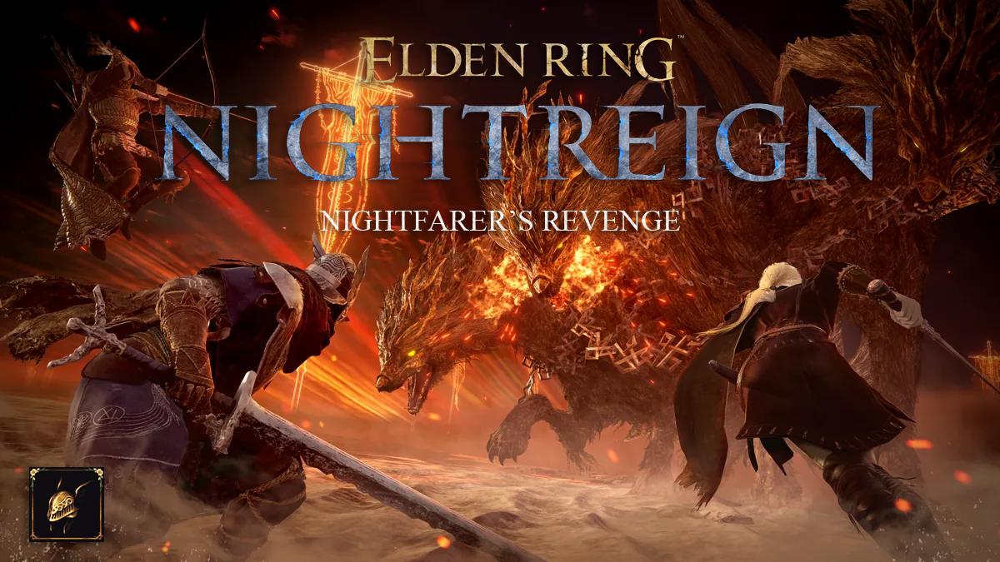
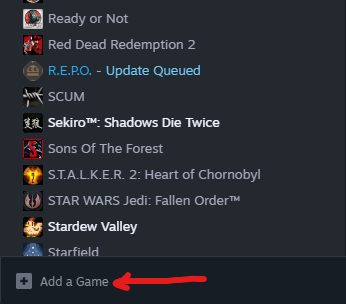
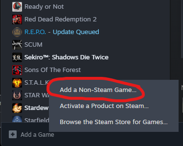
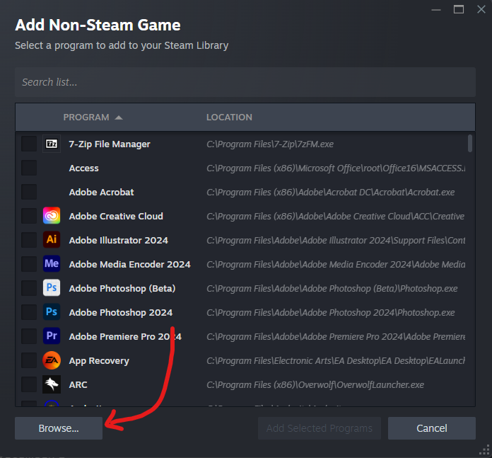
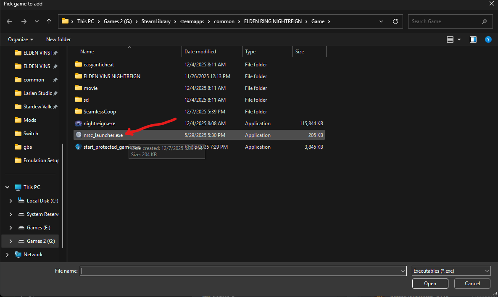
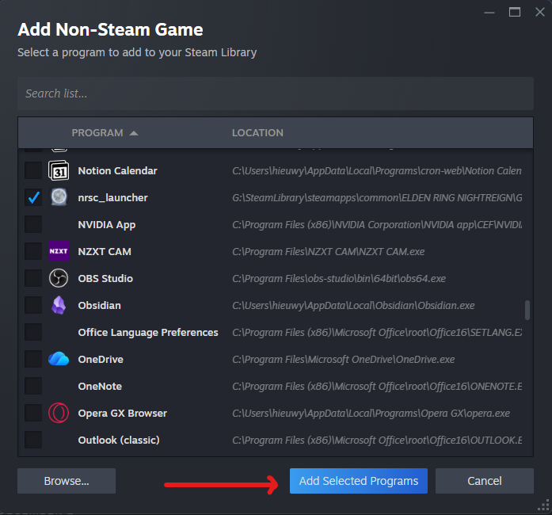
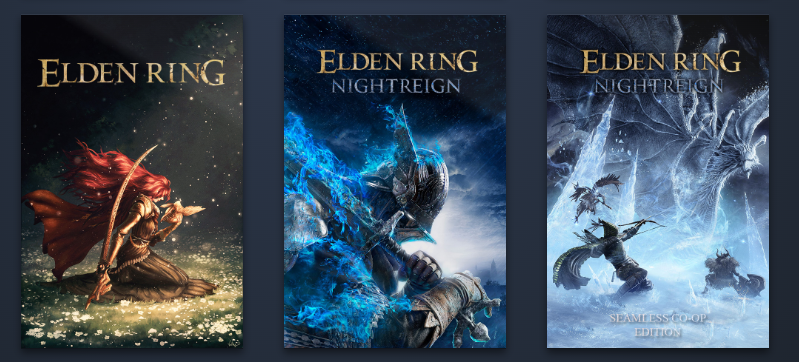
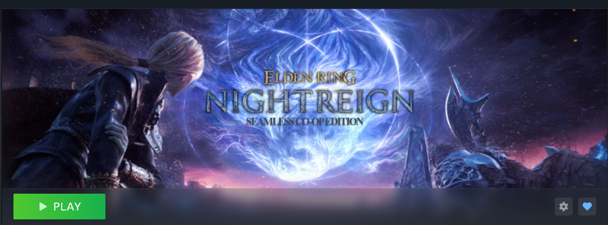
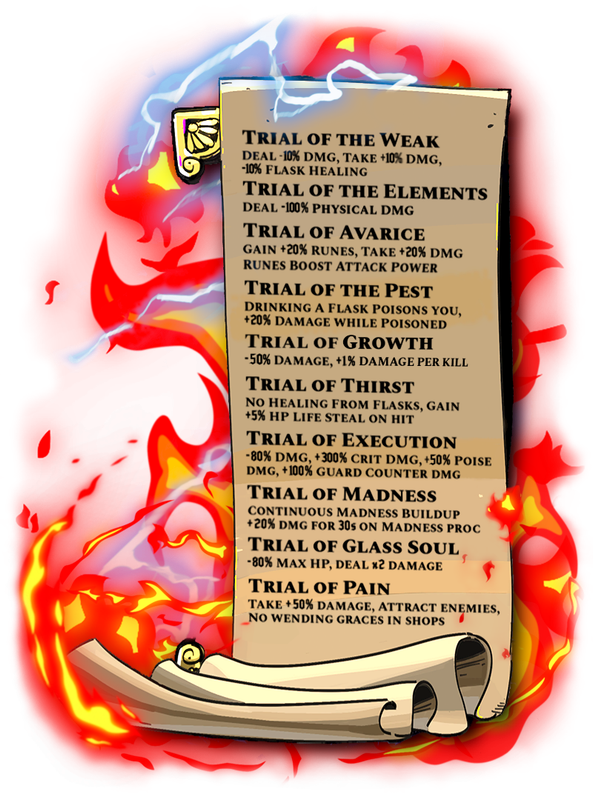

# ELDEN RING: NIGHTFARER'S REVENGE (MODPACK)

## About The Mod
This is a curated modpack that aims to better improve the experience of Elden Ring Nightreign. Introducing features from SEAMLESS CO-OP and Elden Vins, this modpack aims to change the dynamic of gameplay by adding several features to help improve the flow of gameplay amongst the Nighfarers. 

## Forsaken Hollows Update! (PLEASE READ)

- Forsaken Hollows DLC Update has broken Elden Vins Nightreign temporarily until the mod updates. As of now,  **PLEASE DELETE YOUR ELDEN VINS NIGHREIGN FOLDER** and download the Seamless Co-Op update [here](https://www.nexusmods.com/eldenringnightreign/mods/3?tab=posts) 
- Drag and Drop Files into your Nightreign directory, Overwrite anything if it asks.
- Launch the nrsc_launcher.exe
- PLAY!

### Adding Seamless Co-op to Steam
- While solely playing Seamless Co-op, you are able to add the .exe file to steam as a "Non-Steam game". This will allow you to easier launch the game without having to go into you game directory all of the time. Here's how to do it.

- Open your steam and at the bottom left hand corner, click on the "+ Add a Game".

- Select "Add a Non-Steam Game".

- Click "Browse":

- Locate your Elden Ring Nightreign Directory, Select the "nrsc_launcher.exe".

-  Add the selected program.

- You should be all set! You can also go to https://www.steamgriddb.com/game/5473447 to find custom artworks so that you can easily identify your game in your library. I would find a Grid, Hero, and Logo. Now your game should look like this on steam:

### Changes:
- All players now visible at the Roundtable Hold
  
- Most weapon classes have a completely new moveset, ashes or war and spells were reworked from making them faster to completely new interpretations, all using a massive amount of new animations from other action games.
  
- The movement speed has been slightly increased, and changed animations for dodge, backstep and run for the ones that don’t have unique animations for it. Also new animations for throwable items, and most consumables can be used on movement.
  
- Considering attacks are much faster now, damage has been scaled down a little to help balance the flow of gameplay.
  
- Successively hitting enemies, deflecting and perfect dodging grabs will increase your Style Rank. Each rank, you’ll get an attack boost: the higher the rank, the more your attack increases. Reaching the last rank will make your body glow with white lightning, which will let you consume all your Style by unleashing an Ultimate Attack by pressing the heavy attack input with your right hand weapon, which will deal a ton of damage (in case of the bow or staff/seal, you have to do the Ultimate Art input instead of heavy attack). Most weapon classes have their own ultimate. Keep in mind the Style gauge is always decreasing, so you’ll have to play aggressive to reach the highest ranks. Spells, arrows or other projectiles don’t usually gain as much Style as melee weapons, but they are very useful to keep your Style from decreasing. The “Style Rank Meter” talisman enables this mechanic, and every hero starts with it. All weapons types can use the Ultimate Attack except whips, torches, handguns and shields. Perfectly dodging grabs will give you a lot of Style.
  
- Added +60 new passives you can get as rewards from bosses - Can be passives that enhance a weapon class, others enhance the Nightfarer's skills, or a powerful buff attached to a curse! All of them are really powerful, and meant to be combined between them to achieve fun synergies!
  

- 10 New Challenges to add variety to your runs! Complete a Trial to unlock the next one, and unlock new visual effects cosmetics the first time you beat a Trial. Complete some Trials with 3 different characters to unlock even more effects!

- New weapons, spells, ashes of war and greases that can drop in expeditions.
  
- New Outfits

## :pushpin: START HERE :pushpin:

| Table of Contents             | 
| ----------------------------- |
| [INSTALLATION (NEW USER)](./installation.md) |

## REQUIRED FILES

[**ER-NR-V1.0**](https://drive.google.com/file/d/1jxzvG5WEDHf-5IY7RztRmq5quyWVzMmS/view?usp=sharing)

## KNOWN ISSUES

- Crashes with Augur boss upon stepping into final boss door.  (This is an issue with the base game. Users are experiencing crashes during boss fights due to most likely an excess in particles. While there are no fixes at this moment, expect a fix with the next base game patch.)

## PLANNED FEATURES
- Launch from Steam Implementation (Non-Steam Program/Custom Cover Art)
- Changes to Revenant's Summons
- Changes to RNG
- Changes to Night Speed
