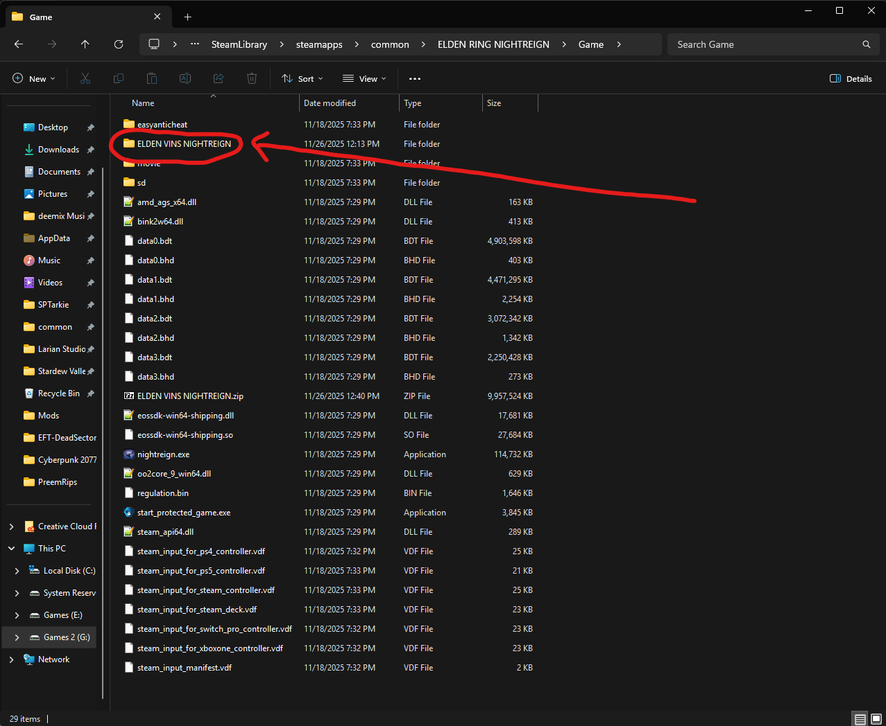
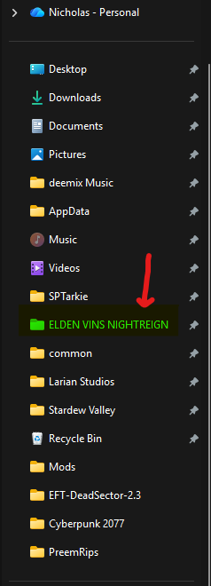
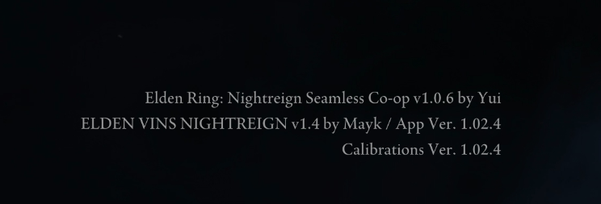
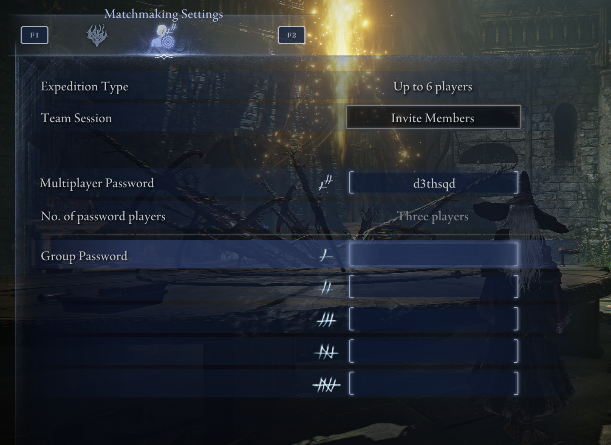

# Installation Guide

## Prerequisites
There are some prerequisites that you will need for the installation process.
1. Download and install [ModEngine3](https://github.com/garyttierney/me3/releases) (not the mod manager, just the installer on the github page)

   
## Step 1
Download the .zip file of Elden Ring Nightfarer's Revenge through a Google Drive Link: [here](https://drive.google.com/file/d/1jxzvG5WEDHf-5IY7RztRmq5quyWVzMmS/view?usp=sharing)

Download the .zip file anywhere on your desktop.

## Step 2 
Open the file directory of your Elden Ring Nightreign Game:

For Example: G:\SteamLibrary\steamapps\common\ELDEN RING NIGHTREIGN\Game

*Alternatively you can just browse local files of the game through Steam.*

Open the .zip file you just downloaded and drag the ELDEN VINS NIGHTREIGN folder into the game directory (same directory with nightreign.exe)

## Step 3

I would Pin the ELDEN VINS NIGHTREIGN folder to your quick access side bar on the file explorer for convenience. 

Assuming that you have now installed the modpack and me3, you can now head into the ELDEN VINS NIGHTREIGN folder and click on the ELDEN VINS NIGHTREIGN.me3 files to start up your game. A console window should appear and the game should launch. 

## Step 4: Post Installation/In-Game Instructions

When launching your game, you should see a new Title Screen showing the Elden Vins as well as Seamless Co-Op at the bottom right to confirm that the mods are working. 

Complete the tutorial of the game. Not sure if there is a faster way to complete this. Just speed-run and die in the beginning. 

In order to connect with each other, we will need to input a "Multiplayer Password" to join the same game. The password is: **d3thsqd**

Receive an invite. 

## ENJOY!
